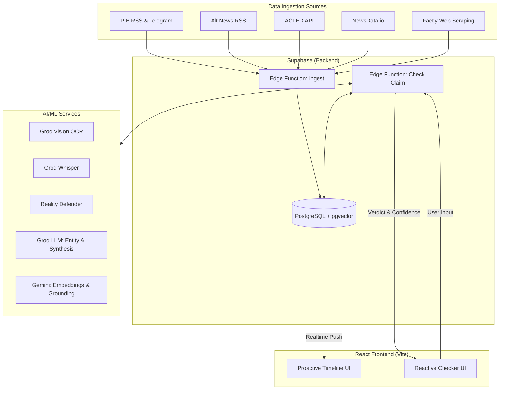
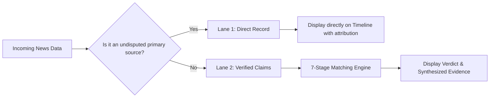
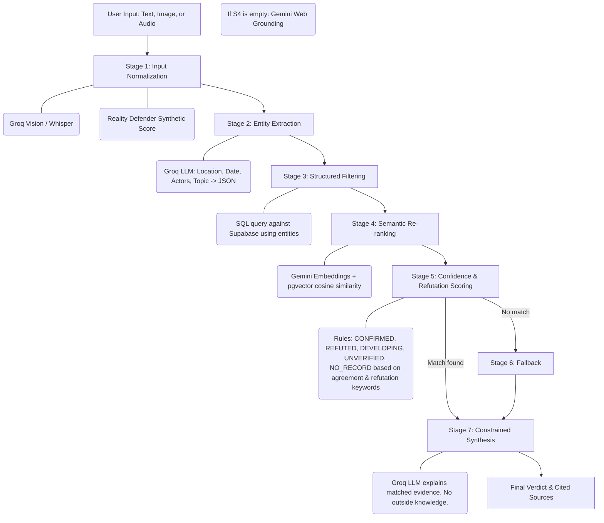

# Pramaan Architecture

This document provides a visual and structural overview of the Pramaan system architecture.

## High-Level System Flow

## The Two-Lane Model

Incoming data is categorized into two lanes to optimize processing and ensure reliability.

## The 7-Stage Matching Engine

This engine powers the reactive checker and processes contentious news for the timeline.

