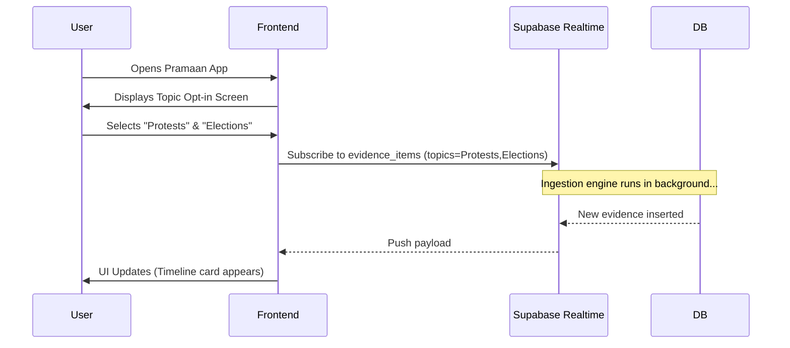
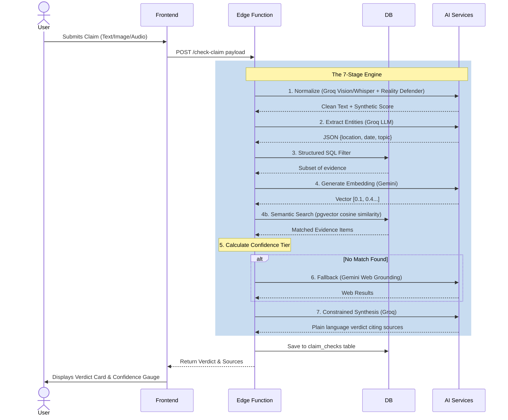

# User Flows

## 1. Proactive Timeline Flow (Lane 1 & 2 Output)

This flow describes how a user interacts with the real-time news feed.

## 2. Reactive Checker Flow (7-Stage Engine)

This flow describes the journey of a user verifying a specific piece of information.

